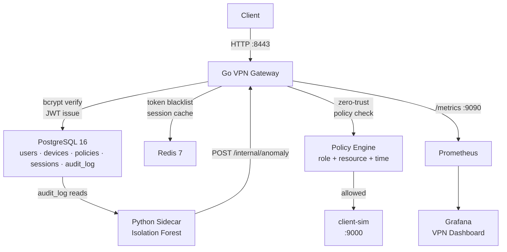

# TunnelForge

A self-hosted SSL VPN Gateway with Zero-Trust Access Policies built with Go, Python, PostgreSQL, Redis, Prometheus, and Grafana.

## Stack

| Component | Technology |
|---|---|
| VPN Gateway | Go 1.26+, chi router, JWT HS256 |
| Zero-Trust Policy Engine | Go — role + resource + time-based access control |
| Session Management | JWT + Redis token blacklist |
| Behavioral Anomaly Detection | Python 3.13, Isolation Forest (scikit-learn) |
| Data Store | PostgreSQL 16 |
| Session/Token Cache | Redis 7 |
| Metrics | Prometheus + Grafana |
| Container Runtime | Docker + Docker Compose |

## Architecture


## Zero-Trust Policies

| Policy | Role | Allowed Hours | Allowed Resources |
|---|---|---|---|
| admin-policy | admin | 0–23 | /admin, /api, /metrics |
| user-policy | user | 0–23 | /api |
| restricted-user | user | 9–17 | /api/readonly |

## API Endpoints

| Method | Route | Auth | Description |
|---|---|---|---|
| POST | /auth/login | No | Authenticate, receive JWT |
| POST | /auth/logout | Yes | Revoke session, blacklist token |
| GET | /session/me | Yes | Return current session claims |
| GET | /api/* | Yes | Proxied resource — policy enforced |
| GET | /admin/* | Yes | Admin resource — admin role only |
| POST | /internal/anomaly | No | Sidecar anomaly notification |
| GET | /health | No | Health check |

## Quick Start

### Prerequisites
- Docker Desktop
- Go 1.26+
- Python 3.13+

### Run
```bash
git clone https://github.com/Isshaan-Dhar/TunnelForge
cd TunnelForge
cp .env.example .env
docker compose up --build -d
```

### Test
```bash
# Login
curl -X POST http://localhost:8443/auth/login \
  -H "Content-Type: application/json" \
  -d '{"username":"alice","password":"password"}'

# Access allowed resource
curl http://localhost:8443/api -H "Authorization: Bearer <token>"

# Access denied resource (user role cannot access /admin)
curl http://localhost:8443/admin -H "Authorization: Bearer <token>"

# Logout (blacklists token in Redis)
curl -X POST http://localhost:8443/auth/logout -H "Authorization: Bearer <token>"
```

## Observability

| Service | URL |
|---|---|
| Grafana Dashboard | http://localhost:3000 (admin/admin) |
| Prometheus | http://localhost:9090 |
| Gateway Health | http://localhost:8443/health |
| Gateway Metrics | http://localhost:9090 |

## Security Properties

- JWT HS256 authentication with 24-hour expiry
- Redis token blacklist for immediate session revocation
- bcrypt password hashing (cost 10)
- Zero-trust policy enforcement per request (role + resource + time)
- Full audit trail in PostgreSQL for every auth and access event
- Behavioral anomaly detection via Isolation Forest on per-user session patterns
- Configurable per-role access policies with time-window restrictions